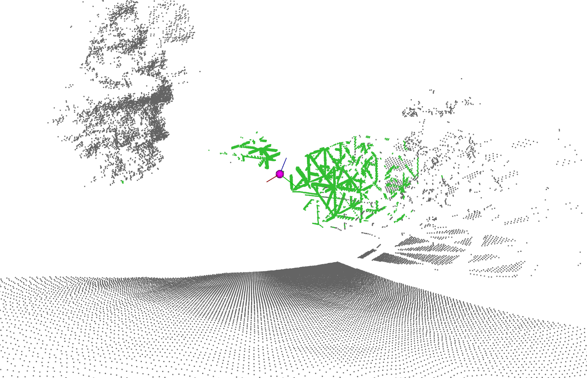
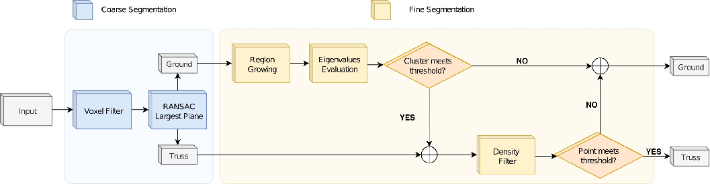

# Reticular Structures Segmentation Methods (rs_seg_methods)

Methods for the segmentation of reticular structures using 3D LiDAR data.

This repository contains source code for the application of diferent methods to segment reticular structures. Data is achieved using a simulated 3D LiDAR sensor. All the methods present in this repository aims to binary segment the strcutres from the background.

Repository is divided in two main folders: analytical and deep_learning

### ANALYTICAL
This folder contain source code for the implementation of an algorithm to segment reticular structures in outdoor environments. This algorithm requires previous knowledge of the structure, the lenght and the width of its bars. The algorithm follows the next diagram work flow.

### DEEP LEARNING
Four deep learning methods can be used to apply binary segmentation with this repository. This methods are: PointNet, PointNet++, MinkUNet34C and PointTransformerV3. Some of the results obtained with this models are reflected in the next table. 

| MODEL              | FEATURES  | OPTIMIZER | SCHEDULER  | F1_SCORE | MIOU   | TP       | FP      | TN       | FN      |
| ------------------ | --------- | --------- | ---------- | -------- | ------ | -------- | ------- | -------- | ------- |
| PointTransformerV3 | XYZNXNYNZ | AdamW     | OneCycleLR | 98,79%   | 97,60% | 22327354 | 11482   | 16693999 | 536931  |
| PointTransformerV3 | XYZC      | AdamW     | OneCycleLR | 98,46%   | 96,96% | 22179888 | 10555   | 16694926 | 684397  |
| PointTransformerV3 | XYZ       | AdamW     | OneCycleLR | 98,72%   | 97,48% | 22300058 | 13132   | 16692349 | 564227  |
| PointTransformerV3 | NXNYNZ    | AdamW     | OneCycleLR | 98,36%   | 96,78% | 22138548 | 10702   | 16694779 | 725737  |
| PointTransformerV3 | C         | AdamW     | OneCycleLR | 99,35%   | 98,71% | 22580697 | 10425   | 16695056 | 283588  |
| PointNet++         | XYZNXNYNZ | adam      | plateau    | 92,07%   | 85,31% | 20303511 | 936668  | 15768813 | 2560774 |
| PointNet++         | XYZC      | adam      | plateau    | 97,09%   | 94,35% | 22156480 | 619641  | 16085840 | 707805  |
| PointNet++         | XYZ       | adam      | plateau    | 77,22%   | 62,89% | 15880131 | 2387160 | 14318321 | 6984154 |
| PointNet++         | NXNYNZ    | adam      | plateau    | 93,16%   | 87,20% | 20998161 | 1215742 | 15489739 | 1866124 |
| PointNet++         | C         | adam      | plateau    | 97,12%   | 94,41% | 22026361 | 466385  | 16239096 | 837924  |
| PointNet           | XYZNXNYNZ | adam      | plateau    | 94,49%   | 89,55% | 10056968 | 231333  | 7949302  | 942397  |
| PointNet           | XYZC      | adam      | plateau    | 95,41%   | 91,22% | 10154349 | 132728  | 8047907  | 845016  |
| PointNet           | XYZ       | adam      | plateau    | 79,78%   | 66,36% | 7520098  | 333594  | 7847041  | 3479267 |
| PointNet           | NXNYNZ    | adam      | plateau    | 62,51%   | 45,46% | 6830482  | 4024601 | 4156034  | 4168883 |
| PointNet           | C         | adam      | plateau    | 84,60%   | 73,31% | 9087651  | 1396327 | 6784308  | 1911714 |
| MinkUNet34C        | XYZNXNYNZ | adam      | plateau    | 89,84%   | 81,56% | 19882413 | 1513231 | 15192250 | 2981872 |
| MinkUNet34C        | XYZC      | adam      | plateau    | 94,70%   | 89,93% | 21130736 | 633579  | 16071902 | 1733549 |
| MinkUNet34C        | XYZ       | adam      | plateau    | 88,89%   | 80,01% | 19426171 | 1415812 | 15289669 | 3438114 |
| MinkUNet34C        | NXNYNZ    | adam      | plateau    | 83,58%   | 71,80% | 17448112 | 1438069 | 15267412 | 5416173 |
| MinkUNet34C        | C         | adam      | plateau    | 96,03%   | 92,36% | 21978497 | 931985  | 15773496 | 885788  |